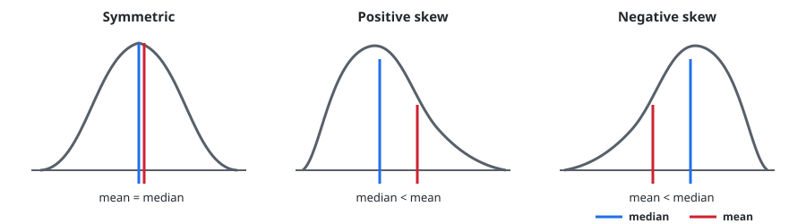
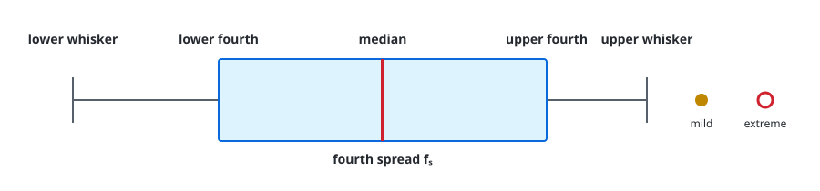

# Chapter 1 — Overview and Descriptive Statistics

**Course:** EGN 2440 — Probability & Statistics with Calculus (USF Fall 2026)
**Sections:** 1.3 Measures of Location (pp. 28–33), 1.4 Measures of Variability (pp. 35–43).

## 1. Measures of Location

### Mean and Median

> **Definition (Sample mean).** The arithmetic average of $n$ observations.

$$
\bar{x}=\frac{1}{n}\sum_{i=1}^{n}x_i
$$

The mean is the sample's **balance point**. It uses every observation, so an outlier can move it substantially. Report $\bar{x}$ with one more decimal place than the data.

> **Definition (Population mean).** For a finite population of $N$ values,

$$
\mu=\frac{1}{N}\sum_{i=1}^{N}x_i
$$

The sample mean $\bar{x}$ estimates the population mean $\mu$.

> **Definition (Sample median).** After ordering the data, $\tilde{x}$ is the middle value when $n$ is odd and the average of the two middle values when $n$ is even.

The median is resistant to outliers. Its population counterpart is $\tilde{\mu}$.

| Distribution shape | Typical relationship |
|---|---|
| Symmetric | $\mu\approx\tilde{\mu}$ |
| Positive skew; long right tail | $\mu>\tilde{\mu}$ |
| Negative skew; long left tail | $\mu<\tilde{\mu}$ |

Use the median for strongly skewed or outlier-prone data, such as incomes. Use the mean when every magnitude should influence the center.

### Quartiles, Percentiles, and Trimmed Means

| Measure | Interpretation |
|---|---|
| $Q_1$ | about 25% of observations lie at or below it |
| $Q_2=\tilde{x}$ | median; about 50% lie at or below it |
| $Q_3$ | about 75% lie at or below it |
| $k$th percentile | about $k\%$ lie at or below it |

> **Definition ($a\%$ trimmed mean).** Remove the smallest and largest $a\%$ of observations, then average the remaining values; denote the result by $\bar{x}_{tr}(a)$.

A trimmed mean compromises between the outlier-sensitive mean and the resistant median. Trimming 5–25% from each end is common; interpolation may be needed when $na$ is not an integer.

### Categorical Data

Frequencies and relative frequencies summarize categorical data. For a category appearing $x$ times in a sample of size $n$,

$$
\hat{p}=\frac{x}{n}
$$

estimates the population proportion $p$. If membership is coded as 1 and nonmembership as 0, the sample mean of the codes equals $\hat{p}$.

## 2. Measures of Variability

Center alone cannot describe spread: samples can have the same mean and median but very different dispersion.

> **Definition (Range).** $\max x_i-\min x_i$.

The range is quick but uses only the two extremes, so it ignores how the remaining observations are distributed.

### Variance and Standard Deviation

Deviations from the sample mean always cancel:

$$
\sum_{i=1}^{n}(x_i-\bar{x})=0
$$

Squaring prevents cancellation.

> **Definition (Sample variance).** The average squared deviation using $n-1$ degrees of freedom.

$$
s^2=\frac{\sum_{i=1}^{n}(x_i-\bar{x})^2}{n-1}=\frac{S_{xx}}{n-1}
$$

> **Definition (Sample standard deviation).** $s=\sqrt{s^2}$; it has the same units as the observations and represents a typical distance from $\bar{x}$.

Only $n-1$ deviations are free because they must sum to zero. Dividing by $n-1$ also corrects the tendency of deviations from the sample mean to underestimate population variability.

For a finite population,

$$
\sigma^2=\frac{1}{N}\sum_{i=1}^{N}(x_i-\mu)^2,
\qquad \sigma=\sqrt{\sigma^2}
$$

The computational identity

$$
S_{xx}=\sum x_i^2-\frac{(\sum x_i)^2}{n}
$$

avoids computing each deviation. Keep full precision in intermediate calculations because both forms are sensitive to rounding.

### Shifts and Scaling

| Transformation | Effect on center | Effect on spread |
|---|---|---|
| $y_i=x_i+c$ | $\bar{y}=\bar{x}+c$ | $s_y^2=s_x^2$, $s_y=s_x$ |
| $y_i=cx_i$ | $\bar{y}=c\bar{x}$ | $s_y^2=c^2s_x^2$, $s_y=|c|s_x$ |

Adding a constant changes location but not spread. Multiplying changes both.

## 3. Boxplots and Outliers

> **Definition (Fourths).** The lower and upper fourths are the medians of the lower and upper halves of the ordered data. If $n$ is odd, include the overall median in both halves.

The **fourth spread** is

$$
f_s=\text{upper fourth}-\text{lower fourth}
$$

It measures the middle 50% of the data and is resistant to extreme observations.

A five-number summary contains the minimum, lower fourth, median, upper fourth, and maximum. In a modified boxplot, whiskers stop at the most extreme observations that are not outliers.

| Observation's distance from the nearest fourth | Classification |
|---|---|
| at most $1.5f_s$ | not an outlier |
| more than $1.5f_s$ but at most $3f_s$ | mild outlier |
| more than $3f_s$ | extreme outlier |

Side-by-side boxplots compare center, spread, skewness, and outliers across groups.

## Quick Reference

| Symbol / term | Meaning |
|---|---|
| $\bar{x}$ / $\mu$ | sample mean / population mean |
| $\tilde{x}$ / $\tilde{\mu}$ | sample median / population median |
| $Q_1,Q_2,Q_3$ | quartiles; $Q_2=\tilde{x}$ |
| $\bar{x}_{tr}(a)$ | mean after trimming $a\%$ from each tail |
| $\hat{p}=x/n$ | sample proportion; estimates $p$ |
| Range | $\max x_i-\min x_i$ |
| $S_{xx}$ | $\sum(x_i-\bar{x})^2=\sum x_i^2-(\sum x_i)^2/n$ |
| $s^2$ / $s$ | sample variance / sample standard deviation |
| $\sigma^2$ / $\sigma$ | population variance / population standard deviation |
| $n-1$ df | one deviation is fixed because all deviations sum to zero |
| Fourth spread $f_s$ | upper fourth minus lower fourth |
| Outlier cutoff | farther than $1.5f_s$ from the nearest fourth; extreme beyond $3f_s$ |