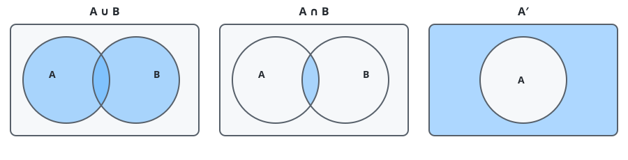
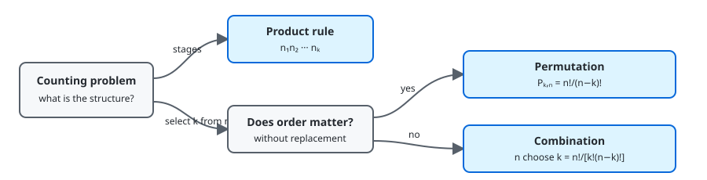
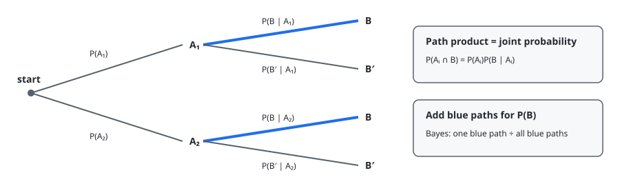

# Chapter 2 — Probability

**Course:** EGN 2440 — Probability & Statistics with Calculus (USF Fall 2026)
**Sections:** 2.1 Sample Spaces and Events (pp. 51–54), 2.2 Axioms, Interpretations, and Properties of Probability (pp. 55–62), 2.3 Counting Techniques (pp. 64–72), 2.4 Conditional Probability (pp. 73–80), 2.5 Independence (pp. 83–86).

## 1. Sample Spaces and Events

> **Definition (Experiment).** A process whose outcome is uncertain.
>
> **Definition (Sample space).** The set $S$ of all possible outcomes.
>
> **Definition (Event).** Any subset of $S$. A simple event contains one outcome; a compound event contains more than one.

A sample space may be finite, countably infinite, or continuous. An event occurs when the observed outcome belongs to that event.

### Set Operations

| Operation | Notation | Meaning |
|---|---|---|
| Complement | $A'$ | outcomes in $S$ but not in $A$ |
| Union | $A\cup B$ | $A$ or $B$, including both |
| Intersection | $A\cap B$ | both $A$ and $B$ |
| Null event | $\emptyset$ | contains no outcomes |

> **Definition (Mutually exclusive).** Events are mutually exclusive, or disjoint, when they share no outcomes: $A\cap B=\emptyset$.

For several events, **pairwise disjoint** means every pair has an empty intersection.

## 2. Probability Rules

### Axioms

Every valid probability assignment satisfies:

1. $P(A)\ge 0$ for every event $A$.
2. $P(S)=1$.
3. For disjoint events $A_1,A_2,\ldots$,

$$
P\left(\bigcup_{i=1}^{\infty}A_i\right)=\sum_{i=1}^{\infty}P(A_i)
$$

Consequences include $P(\emptyset)=0$, $0\le P(A)\le 1$, and finite additivity for disjoint events.

### Interpreting Probability

| Interpretation | Meaning | Best suited for |
|---|---|---|
| Objective | long-run relative frequency $n(A)/n$ | repeatable experiments |
| Subjective | degree of belief based on available information | unique or unrepeatable events |

### Complement and Addition Rules

$$
P(A')=1-P(A)
$$

The complement rule is especially useful for **at least one**: compute the probability of none, then subtract from 1.

For disjoint events,

$$
P(A\cup B)=P(A)+P(B)
$$

For any two events,

$$
P(A\cup B)=P(A)+P(B)-P(A\cap B)
$$

The intersection is subtracted because it was counted twice. For three events,

$$
\begin{aligned}
P(A\cup B\cup C)
&=P(A)+P(B)+P(C)\\
&\quad-P(A\cap B)-P(A\cap C)-P(B\cap C)\\
&\quad+P(A\cap B\cap C)
\end{aligned}
$$

### Assigning Probabilities

For finite or countably infinite $S$, assign probabilities to simple events so they sum to 1. Then add the probabilities of the simple events inside a compound event.

If $S$ has $N$ equally likely outcomes and event $A$ contains $N(A)$ of them,

$$
P(A)=\frac{N(A)}{N}
$$

Probability then becomes a counting problem.

## 3. Counting Techniques

> **Proposition (Product rule).** If a process has $k$ stages with $n_i$ possible choices at stage $i$ for every earlier sequence of choices, the total number of outcomes is

$$
n_1n_2\cdots n_k
$$

A tree diagram is more flexible when different branches have different numbers of later choices.

### Permutations and Combinations

These formulas select $k$ objects from $n$ distinct objects without replacement.

| Selection | Order matters? | Count |
|---|---:|---:|
| Permutation | yes | $P_{k,n}=\dfrac{n!}{(n-k)!}$ |
| Combination | no | $\dbinom{n}{k}=\dfrac{n!}{k!(n-k)!}$ |

Here $0!=1$. Since each group of $k$ objects has $k!$ orderings,

$$
P_{k,n}=k!\binom{n}{k}
$$

For a population split into groups of sizes $N_1$ and $N_2$, the probability that an equally likely sample of size $k$ contains exactly $j$ objects from group 1 is

$$
\frac{\binom{N_1}{j}\binom{N_2}{k-j}}{\binom{N_1+N_2}{k}}
$$

This is the counting pattern behind the hypergeometric distribution.

## 4. Conditional Probability

> **Definition (Conditional probability).** For $P(B)>0$, the probability of $A$ after learning that $B$ occurred is

$$
P(A\mid B)=\frac{P(A\cap B)}{P(B)}
$$

Conditioning shrinks the relevant sample space from $S$ to $B$. In general, $P(A\mid B)\ne P(B\mid A)$.

### Multiplication Rule

Rearranging the definition gives

$$
P(A\cap B)=P(A\mid B)P(B)
$$

For a sequence of three events,

$$
P(A_1\cap A_2\cap A_3)
=P(A_1)P(A_2\mid A_1)P(A_3\mid A_1\cap A_2)
$$

Multiply probabilities along a tree path to obtain the joint probability of that sequence.

## 5. Total Probability and Bayes' Theorem

> **Definition (Partition).** Events $A_1,\ldots,A_k$ form a partition of $S$ when they are mutually exclusive and exhaustive: exactly one must occur.

For a partition, event $B$ is split into disjoint pieces $A_i\cap B$. Therefore,

$$
P(B)=\sum_{i=1}^{k}P(B\mid A_i)P(A_i)
$$

This is the **law of total probability**.

> **Theorem (Bayes).** For $P(B)>0$,

$$
P(A_j\mid B)
=\frac{P(B\mid A_j)P(A_j)}{\sum_{i=1}^{k}P(B\mid A_i)P(A_i)}
$$

Bayes' theorem updates a **prior** $P(A_j)$ to a **posterior** $P(A_j\mid B)$. On a probability tree, divide the joint probability on the relevant $B$ path by the sum of all $B$ path probabilities.

When the prior probability is very small, even accurate evidence can leave a modest posterior because false positives from the much larger complementary group may dominate.

## 6. Independence

> **Definition (Independence).** Events $A$ and $B$ are independent when learning that one occurred does not change the probability of the other.

Equivalent criteria are

$$
P(A\mid B)=P(A),
\qquad
P(B\mid A)=P(B),
\qquad
P(A\cap B)=P(A)P(B)
$$

The product criterion does not require dividing by a probability, so it is usually the easiest test.

Mutually exclusive events with positive probabilities are **not** independent: one occurring makes the other impossible. If $A$ and $B$ are independent, then their complements are also independent in every pairing.

> **Definition (Mutual independence).** Events $A_1,\ldots,A_n$ are mutually independent when every intersection of two or more selected events equals the product of their individual probabilities.

Checking only the intersection of all $n$ events is insufficient; every subset must satisfy the product rule.

## Quick Reference

| Symbol / concept | Meaning |
|---|---|
| $S$ | sample space; all possible outcomes |
| Event | any subset of $S$ |
| $A'$, $A\cup B$, $A\cap B$ | complement, union, intersection |
| Mutually exclusive | $A\cap B=\emptyset$ |
| Probability axioms | nonnegative; $P(S)=1$; additive over disjoint events |
| Complement rule | $P(A')=1-P(A)$ |
| Addition rule | $P(A\cup B)=P(A)+P(B)-P(A\cap B)$ |
| Equally likely outcomes | $P(A)=N(A)/N$ |
| Product rule | multiply the numbers of choices across stages |
| $P_{k,n}$ | $n!/(n-k)!$; order matters |
| $\binom{n}{k}$ | $n!/[k!(n-k)!]$; order does not matter |
| $P(A\mid B)$ | $P(A\cap B)/P(B)$ |
| Multiplication rule | $P(A\cap B)=P(A\mid B)P(B)$ |
| Partition | mutually exclusive and exhaustive events |
| Total probability | $P(B)=\sum_iP(B\mid A_i)P(A_i)$ |
| Bayes' theorem | posterior $=$ relevant joint probability divided by $P(B)$ |
| Independent events | $P(A\cap B)=P(A)P(B)$ |
| Mutual independence | product rule holds for every subset of two or more events |