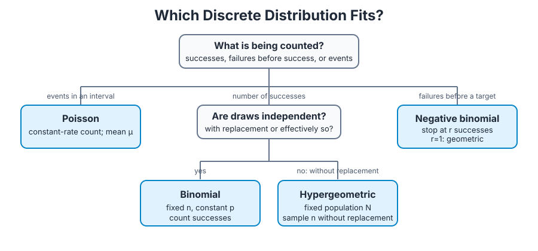

# Chapter 3 — Discrete Random Variables and Probability Distributions

**Course:** EGN 2440 — Probability & Statistics with Calculus (USF Fall 2026)
**Sections:** 3.1 Random Variables (pp. 93–96), 3.2 Probability Distributions for Discrete Random Variables (pp. 96–106), 3.3 Expected Values (pp. 107–114), 3.4 The Binomial Probability Distribution (pp. 114–122), 3.5 Hypergeometric and Negative Binomial Distributions (pp. 122–128), 3.6 The Poisson Probability Distribution (pp. 128–132).

## 1. Random Variables

> **Definition (Random variable).** A random variable (rv) is a function that assigns a real number to every outcome in a sample space $S$. Uppercase letters such as $X$ name random variables; lowercase letters such as $x$ denote their realized values.

> **Definition (Bernoulli random variable).** A random variable with only the values 0 and 1. Conventionally, 1 represents success and 0 represents failure.

> **Definition (Discrete random variable).** A random variable whose possible values are finite or can be listed in an infinite sequence.

> **Definition (Continuous random variable).** A random variable whose possible values fill one or more intervals and for which $P(X=c)=0$ for every individual value $c$.

Discrete variables arise from counts, such as the number of failed components. Continuous variables arise from measurements, such as a component's failure time. A discrete variable may have infinitely many possible values, provided they are countable.

## 2. Probability Distributions for Discrete Random Variables

> **Definition (Probability mass function).** For a discrete random variable $X$, its pmf is $p(x)=P(X=x)$. It gives the probability assigned to each possible value of $X$.

A valid pmf satisfies

$$
p(x)\ge 0
$$

and

$$
\sum_{x\in D}p(x)=1,
$$

where $D$ is the set of possible values of $X$. Probabilities of events are found by adding the relevant masses; for example, $P(a\le X\le b)$ is the sum of $p(x)$ over possible values from $a$ through $b$.

A **parameter** is a quantity whose value selects one distribution from a family. For a Bernoulli rv with success probability $p$,

$$
p(x;p)=
\begin{cases}
1-p & x=0,\\
p & x=1,\\
0 & \text{otherwise.}
\end{cases}
$$

> **Definition (Cumulative distribution function).** The cdf of $X$ is $F(x)=P(X\le x)$.

For a discrete rv,

$$
F(x)=\sum_{y\le x}p(y).
$$

The graph of a discrete cdf is a nondecreasing step function: it jumps at possible values of $X$ and is flat between them. The cdf recovers point and interval probabilities. If the possible values are integers,

$$
P(X=a)=F(a)-F(a-1)
$$

and

$$
P(a\le X\le b)=F(b)-F(a-1).
$$

## 3. Expected Values and Variance

> **Definition (Expected value).** For a discrete rv with pmf $p(x)$ and possible values $D$, the mean or expected value is the probability-weighted average

$$
E(X)=\mu_X=\sum_{x\in D}x p(x).
$$

The expected value is the distribution's balance point and long-run average over many repetitions. It need not be a possible observed value. A distribution can have a **heavy tail** when appreciable probability remains far from its center; its expected value may even fail to be finite.

> **Proposition (Expected value of a function).** For any function $h$,

$$
E[h(X)]=\sum_{x\in D}h(x)p(x).
$$

For constants $a$ and $b$,

$$
E(aX+b)=aE(X)+b.
$$

> **Definition (Variance and standard deviation).** If $\mu=E(X)$, then

$$
V(X)=\sigma_X^2=E[(X-\mu)^2]=\sum_{x\in D}(x-\mu)^2p(x)
$$

and

$$
\sigma_X=\sqrt{V(X)}.
$$

Variance measures the probability-weighted squared distance from the mean. The standard deviation is in the original units of $X$.

A computational shortcut is

$$
V(X)=E(X^2)-[E(X)]^2.
$$

For a linear transformation,

$$
V(aX+b)=a^2V(X),
\qquad
\sigma_{aX+b}=|a|\sigma_X.
$$

Adding a constant shifts the distribution without changing variability; multiplying by $a$ multiplies the standard deviation by $|a|$.

### Worked Example — Flash-Drive Memory

Let $X$ be the GB capacity of a purchased flash drive with pmf:

| $x$ | 1 | 2 | 4 | 8 | 16 |
|---:|---:|---:|---:|---:|---:|
| $p(x)$ | 0.05 | 0.10 | 0.35 | 0.40 | 0.10 |

The expected capacity is

$$
E(X) = 1(0.05) + 2(0.10) + 4(0.35) + 8(0.40) + 16(0.10) = 6.45\text{ GB}.
$$

Using the definition of variance,

$$
\begin{aligned}
V(X) &= (1-6.45)^2(0.05) + (2-6.45)^2(0.10) \\
&\quad + (4-6.45)^2(0.35) + (8-6.45)^2(0.40) \\
&\quad + (16-6.45)^2(0.10) \\
&= 15.6475\text{ GB}^2.
\end{aligned}
$$

Therefore,

$$
\sigma_X = \sqrt{15.6475} \approx 3.956\text{ GB}.
$$

For the shortcut formula, first compute

$$
E(X^2) = 1^2(0.05) + 2^2(0.10) + 4^2(0.35) + 8^2(0.40) + 16^2(0.10) = 57.25.
$$

Then

$$
V(X) = E(X^2) - [E(X)]^2 = 57.25 - (6.45)^2 = 15.6475\text{ GB}^2.
$$

## 4. Binomial Distribution

> **Definition (Binomial experiment).** A binomial experiment has a fixed number $n$ of trials, two outcomes per trial, independent trials, and a constant success probability $p$.

> **Definition (Binomial random variable).** If $X$ counts successes among $n$ binomial trials, then $X$ has a binomial distribution with parameters $n$ and $p$, and $X$ can be $0,1,\ldots,n$.

With $q=1-p$, the binomial pmf is

$$
b(x;n,p)=\binom{n}{x}p^xq^{n-x},
\qquad x=0,1,\ldots,n.
$$

The combination counts the possible arrangements of $x$ successes; $p^xq^{n-x}$ is the probability of each arrangement. The binomial cdf is

$$
B(x;n,p)=P(X\le x)=\sum_{y=0}^{x}b(y;n,p).
$$

For a binomial rv with parameters $n$ and $p$,

$$
E(X)=np,
\qquad
V(X)=np(1-p)=npq,
\qquad
\sigma_X=\sqrt{npq}.
$$

Sampling without replacement is not exactly binomial because draws are dependent. It can be treated as binomial when the sample size is at most 5% of the population size.

## 5. Hypergeometric and Negative Binomial Distributions

> **Definition (Hypergeometric distribution).** Let a finite population contain $N$ items, including $M$ successes. If a completely random sample of size $n$ is drawn without replacement and $X$ is the number of successes, then $X$ has a hypergeometric distribution.

$$
P(X=x)=h(x;n,M,N)=\frac{\binom{M}{x}\binom{N-M}{n-x}}{\binom{N}{n}}.
$$

The allowable values satisfy

$$
\max\bigl(0,n-(N-M)\bigr)\le x\le\min(n,M).
$$

Writing $p=M/N$ for the population success proportion,

$$
E(X)=np
$$

and

$$
V(X)=\left(\frac{N-n}{N-1}\right)np(1-p).
$$

The factor $(N-n)/(N-1)$ is the **finite population correction**. It is less than 1, so sampling without replacement produces less variability than independent sampling.

> **Definition (Negative binomial distribution).** Perform independent Bernoulli trials with success probability $p$ until $r$ successes occur. If $X$ is the number of failures before the $r$th success, then $X$ is negative binomial.

$$
P(X=x)=nb(x;r,p)=\binom{x+r-1}{r-1}p^r(1-p)^x,
\qquad x=0,1,2,\ldots
$$

The final trial must be the $r$th success; the preceding $x+r-1$ trials contain $r-1$ successes and $x$ failures. Its mean and variance are

$$
E(X)=\frac{r(1-p)}{p},
\qquad
V(X)=\frac{r(1-p)}{p^2}.
$$

When $r=1$, the negative binomial is the geometric distribution for failures before the first success:

$$
P(X=x)=(1-p)^x p,
\qquad x=0,1,2,\ldots
$$

For this failures convention,

$$
E(X)=\frac{1-p}{p},
\qquad
V(X)=\frac{1-p}{p^2}.
$$

Alternatively, define the geometric variable $Y$ as the **number of trials** through the first success. Since $Y=X+1$,

$$
P(Y=y)=(1-p)^{y-1}p,
\qquad y=1,2,3,\ldots
$$

and

$$
E(Y)=\frac{1}{p},
\qquad
V(Y)=\frac{1-p}{p^2}.
$$

Both conventions have the same variance; always identify whether the random variable counts failures or total trials.

## 6. Poisson Distribution and Process

> **Definition (Poisson distribution).** A discrete random variable $X$ has a Poisson distribution with parameter $\mu>0$ when

$$
P(X=x)=p(x;\mu)=e^{-\mu}\frac{\mu^x}{x!},
\qquad x=0,1,2,\ldots
$$

The Poisson model is useful for counts of events in a fixed interval or region, such as defects on a surface, arrivals, or equipment failures. Its parameter is both the mean and variance:

$$
E(X)=V(X)=\mu,
\qquad
\sigma_X=\sqrt{\mu}.
$$

A binomial distribution is approximated by Poisson when $n$ is large, $p$ is small, and $\mu=np$. A common guideline is $n>50$ and $np<5$.

> **Definition (Poisson process).** A Poisson process has a constant event rate $\alpha$: short, disjoint intervals have independent counts; the chance of one event in a short interval is approximately proportional to its length; and multiple events in a sufficiently short interval are negligible.

For an interval of length $t$, the count is Poisson with parameter $\mu=\alpha t$:

$$
P(X=k)=e^{-\alpha t}\frac{(\alpha t)^k}{k!}.
$$

Thus the expected number of events in time $t$ is $\alpha t$, while $\alpha$ is the expected rate per unit time. The same model applies spatially when $\alpha$ is an expected rate per unit area or volume.

## Quick Reference

| Symbol / concept | Meaning / formula |
|---|---|
| Random variable $X$ | function from outcomes to real numbers |
| Discrete rv | finite or countably infinite possible values |
| Bernoulli rv | $P(X=1)=p$, $P(X=0)=1-p$; $E(X)=p$, $V(X)=p(1-p)$ |
| pmf | $p(x)=P(X=x)$; nonnegative and sums to 1 |
| cdf | $F(x)=P(X\le x)=\sum_{y\le x}p(y)$ |
| Expected value | $E(X)=\sum x p(x)$ |
| Expected function | $E[h(X)]=\sum h(x)p(x)$ |
| Variance | $V(X)=E[(X-\mu)^2]=E(X^2)-\mu^2$ |
| Linear rules | $E(aX+b)=aE(X)+b$; $V(aX+b)=a^2V(X)$ |
| Binomial | $\binom{n}{x}p^x(1-p)^{n-x}$; $E(X)=np$, $V(X)=np(1-p)$ |
| Hypergeometric | sample without replacement; $\dfrac{\binom{M}{x}\binom{N-M}{n-x}}{\binom{N}{n}}$ |
| Negative binomial | failures before $r$th success; $\binom{x+r-1}{r-1}p^r(1-p)^x$ |
| Geometric (failures) | $P(X=x)=(1-p)^x p$, $x=0,1,\ldots$; $E(X)=(1-p)/p$, $V(X)=(1-p)/p^2$ |
| Geometric (trials) | $P(Y=y)=(1-p)^{y-1}p$, $y=1,2,\ldots$; $E(Y)=1/p$, $V(Y)=(1-p)/p^2$ |
| Poisson | $e^{-\mu}\mu^x/x!$; $E(X)=V(X)=\mu$ |
| Poisson process | count in time $t$: Poisson with parameter $\alpha t$ |
