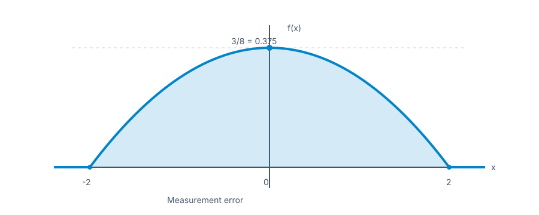

# Chapter 4 — Continuous Random Variables and Probability Distributions

**Course:** EGN 2440 — Probability & Statistics with Calculus (USF Fall 2026)
**Sections:** 4.1 Probability Density Functions (pp. 138–142), 4.2 Cumulative Distribution Functions and Expected Values (pp. 143–150), 4.3 The Normal Distribution (pp. 152–162), 4.4 The Exponential and Gamma Distributions (pp. 165–170), 4.5 Other Continuous Distributions (pp. 171–177), 4.6 Probability Plots (pp. 178–187).

## 1. Probability Density Functions (§4.1)

> **Definition (Continuous random variable).** The possible values fill an interval or a union of intervals, and $P(X=c)=0$ for every individual value $c$. A variable with both a point mass (for example, zero waiting time) and continuously varying positive values is a *mixture*, not purely continuous.

> **Definition (Probability density function).** A pdf $f(x)$ assigns probability by **area**: for $a\le b$,

$$
P(a\le X\le b)=\int_a^b f(x)\,dx.
$$

A valid pdf is nonnegative everywhere and has total area 1:

$$
f(x)\ge 0,\qquad \int_{-\infty}^{\infty}f(x)\,dx=1.
$$

Density *height* is not itself a probability; density can exceed 1 when concentrated in a narrow interval. Since points have zero area, $P(X=c)=0$ and including or excluding either endpoint does not change an interval probability. Thus $P(a<X<b)=P(a\le X\le b)$ for continuous $X$.

> **Definition (Uniform distribution).** If $X$ is uniform on $[A,B]$, its density is constant there: $f(x)=1/(B-A)$ for $A\le x\le B$ and zero elsewhere. Any subinterval of length $d$ inside $[A,B]$ has probability $d/(B-A)$.

Exercise 3 — Measurement error density (§4.1)

The error $X$ in a measurement has pdf $f(x)=0.09375(4-x^2)$ for $-2\le x\le 2$ and $f(x)=0$ otherwise.

- **a.** Sketch the graph of $f(x)$.
- **b.** Compute $P(X>0)$.
- **c.** Compute $P(-1<X<1)$.
- **d.** Compute $P(X<-0.5\text{ or }X>0.5)$.

Solution

Since $0.09375=3/32$, an antiderivative on $[-2,2]$ is $A(x)=\frac{3}{32}(4x-x^3/3)$.

**a. Graph.** The density is a downward-opening parabola, symmetric about zero. Its peak is $f(0)=3/8$; it reaches zero at $x=-2$ and $x=2$ and stays zero outside that interval.

**b. Positive error.** Symmetry splits the total area equally: $P(X>0)=\int_0^2 f(x)\,dx=A(2)-A(0)=1/2$.

**c. Error between $-1$ and $1$.** $P(-1<X<1)=\int_{-1}^{1}f(x)\,dx=A(1)-A(-1)=11/32-(-11/32)=11/16=0.6875$.

**d. Error more than $0.5$ from zero.** The two tails are the complement of the middle interval: $P(X<-0.5\text{ or }X>0.5)=1-P(-0.5\le X\le 0.5)$.

The middle area is $A(0.5)-A(-0.5)=47/128$, so the answer is $1-47/128=81/128=0.6328125$. The strict and non-strict inequalities agree because a single point has probability zero.

## 2. CDFs and Expected Values (§4.2)

> **Definition (Cumulative distribution function).** $F(x)=P(X\le x)$, the area under the pdf to the left of $x$.

$$
F(x)=\int_{-\infty}^{x}f(y)\,dy,\qquad P(a\le X\le b)=F(b)-F(a),\qquad P(X>x)=1-F(x).
$$

Where $F$ is differentiable, $f(x)=F'(x)$. For $X$ uniform on $[A,B]$, $F(x)$ is 0 below $A$, $(x-A)/(B-A)$ from $A$ to $B$, and 1 above $B$. Unlike the discrete integer-valued case, a continuous interval probability needs no shift from $a$ to $a-1$.

> **Definition (Percentile and median).** The $(100p)$th percentile $h(p)$ satisfies $F(h(p))=p$ for $0<p<1$; the median is $h(0.5)$. For a symmetric pdf, the center of symmetry is the median.

> **Definition (Mean and variance).** Integration replaces the sum used for a discrete random variable:

$$
\mu=E(X)=\int_{-\infty}^{\infty}xf(x)\,dx,\qquad E[h(X)]=\int_{-\infty}^{\infty}h(x)f(x)\,dx.
$$

$$
V(X)=\sigma^2=\int_{-\infty}^{\infty}(x-\mu)^2f(x)\,dx=E(X^2)-[E(X)]^2,\qquad \sigma=\sqrt{V(X)}.
$$

For $Y=aX+b$, $E(Y)=a\mu+b$ and $V(Y)=a^2\sigma^2$. A nonlinear $h(X)$ generally requires integrating $h(x)f(x)$; substituting $E(X)$ into $h$ usually does **not** give $E[h(X)]$.

## 3. The Normal Distribution (§4.3)

> **Definition (Normal distribution).** $X\sim N(\mu,\sigma^2)$ has a symmetric, bell-shaped density with mean and median $\mu$ and standard deviation $\sigma>0$:

$$
f(x;\mu,\sigma)=\frac{1}{\sigma\sqrt{2\pi}}\exp\!\left(-\frac{(x-\mu)^2}{2\sigma^2}\right),\qquad -\infty<x<\infty.
$$

The curve's inflection points occur at $\mu-\sigma$ and $\mu+\sigma$. Larger $\sigma$ means a wider, lower curve.

> **Definition (Standard normal).** $Z\sim N(0,1)$ has cdf $\Phi(z)=P(Z\le z)$. For any normal $X$, standardize by $Z=(X-\mu)/\sigma$: a $z$-score measures distance from the mean in standard deviations.

$$
P(a\le X\le b)=\Phi\!\left(\frac{b-\mu}{\sigma}\right)-\Phi\!\left(\frac{a-\mu}{\sigma}\right).
$$

Symmetry gives $\Phi(-z)=1-\Phi(z)$. If $z_p$ is the $p$-quantile of the standard normal, the corresponding $X$ percentile is $\mu+\sigma z_p$. The book's *upper-tail* critical value $z_\alpha$ satisfies $P(Z>z_\alpha)=\alpha$, so $z_\alpha=z_{1-\alpha}$ in quantile notation. Common values: $z_{0.05}=1.645$, $z_{0.025}=1.96$, $z_{0.01}=2.33$.

For an approximately normal population, roughly 68%, 95%, and 99.7% of observations lie within 1, 2, and 3 standard deviations of the mean, respectively (*empirical rule*).

### Approximating discrete counts

A normal curve approximating an integer-valued histogram needs a **continuity correction**: $P(X\le k)$ uses the normal area to $k+0.5$, while $P(a\le X\le b)$ uses $a-0.5$ to $b+0.5$. For a binomial count $X\sim\text{Bin}(n,p)$, use $\mu=np$ and $\sigma=\sqrt{np(1-p)}$. The textbook's practical condition for adequate approximation is both $np\ge10$ and $n(1-p)\ge10$; exact binomial probabilities remain preferable when easily available. The sample proportion $X/n$ is then approximately normal with mean $p$ and standard deviation $\sqrt{p(1-p)/n}$.

## 4. Exponential, Gamma, and Chi-Squared Distributions (§4.4)

> **Definition (Exponential distribution).** For rate $\lambda>0$, the waiting time $X$ has $f(x)=\lambda e^{-\lambda x}$ for $x\ge0$ and zero otherwise.

$$
F(x)=1-e^{-\lambda x}\ (x\ge0),\qquad P(X>x)=e^{-\lambda x},\qquad E(X)=\frac1\lambda,\qquad V(X)=\frac1{\lambda^2}.
$$

The alternative scale parameter is $\beta=1/\lambda$. If arrivals form a Poisson process with rate $\lambda$ per unit time and independent counts in disjoint intervals, time between arrivals is exponential. It is *memoryless*: $P(X>s+t\mid X>s)=P(X>t)=e^{-\lambda t}$. This may be unsuitable when component failure risk changes with age.

> **Definition (Gamma function).** For $\alpha>0$, $\Gamma(\alpha)=\int_0^\infty x^{\alpha-1}e^{-x}\,dx$. It satisfies $\Gamma(n)=(n-1)!$ for positive integers and $\Gamma(1/2)=\sqrt{\pi}$.

> **Definition (Gamma distribution).** With shape $\alpha>0$ and scale $\beta>0$, $X$ has $f(x)=x^{\alpha-1}e^{-x/\beta}/[\beta^\alpha\Gamma(\alpha)]$ for $x\ge0$, zero otherwise. Then $E(X)=\alpha\beta$ and $V(X)=\alpha\beta^2$. The exponential is the special case $\alpha=1$, $\beta=1/\lambda$.

A *standard gamma* has $\beta=1$; if $G_\alpha(t)$ is its cdf, a general gamma has $P(X\le x)=G_\alpha(x/\beta)$. The cdf is an incomplete-gamma integral rather than an elementary formula. For integer shape $n$, the gamma is also called *Erlang*: it models the wait for the $n$th event in a Poisson process.

> **Definition (Chi-squared distribution).** $\chi^2_\nu$ is a gamma distribution with shape $\nu/2$ and scale 2, where the positive integer $\nu$ is its degrees of freedom. It has mean $\nu$ and variance $2\nu$; the square of one standard normal variable has $\chi^2_1$ distribution.

## 5. Other Continuous Distributions (§4.5)

| Family | Density / distribution on its support | Mean and variance | Typical use |
|---|---|---|---|
| Weibull ($\alpha,\beta>0$) | $f(x)=\alpha x^{\alpha-1}e^{-(x/\beta)^\alpha}/\beta^\alpha$, $x\ge0$; $F(x)=1-e^{-(x/\beta)^\alpha}$ | $E(X)=\beta\Gamma(1+1/\alpha)$; $V(X)=\beta^2[\Gamma(1+2/\alpha)-\Gamma(1+1/\alpha)^2]$ | Lifetimes, emissions; shape $\alpha$, scale $\beta$ |
| Lognormal ($\mu,\sigma$) | $\ln X\sim N(\mu,\sigma^2)$, $x>0$; $F(x)=\Phi((\ln x-\mu)/\sigma)$ | $E(X)=e^{\mu+\sigma^2/2}$; $V(X)=e^{2\mu+\sigma^2}(e^{\sigma^2}-1)$ | Positive, right-skewed measurements |
| Beta ($\alpha,\beta>0$) | For $A\le x\le B$, $u=(x-A)/(B-A)$ and $f(x)=\Gamma(\alpha+\beta)u^{\alpha-1}(1-u)^{\beta-1}/[(B-A)\Gamma(\alpha)\Gamma(\beta)]$ | $E(X)=A+(B-A)\alpha/(\alpha+\beta)$; $V(X)=(B-A)^2\alpha\beta/[(\alpha+\beta)^2(\alpha+\beta+1)]$ | Bounded proportions and project activity times |

For Weibull shape $\alpha=1$, the distribution is exponential with rate $1/\beta$. A nonzero Weibull threshold $\gamma$ shifts the support to $x\ge\gamma$; replace $x$ by $x-\gamma$ in its cdf. Lognormal parameters $\mu,\sigma$ describe **$\ln X$**, not $X$; its median is $e^\mu$. The standard beta uses $A=0$, $B=1$. Its shape parameters allow a variety of distributions on a bounded interval.

## 6. Probability Plots (§4.6)

> **Definition (Plotting positions).** Sort the observations $x_{(1)}\le\cdots\le x_{(n)}$. The $i$th is assigned sample percentile $100(i-0.5)/n$; write $p_i=(i-0.5)/n$.

To check a proposed distribution, plot its theoretical percentile at $p_i$ against $x_{(i)}$. Points close to a straight line support the family; systematic curvature argues against it. A plot is diagnostic, not proof of a distribution, and small samples show more random departures.

For a **normal probability plot**, pair $(\Phi^{-1}(p_i),x_{(i)})$. If the sample is approximately normal, the points follow a line with intercept approximately $\mu$ and slope approximately $\sigma$. A light-tailed sample tends to bend *above* the middle line on the left and *below* on the right; heavy tails bend the opposite way. Positive skew often bends above the line at both ends. If $X$ is lognormal, plotting $\ln x_{(i)}$ against normal percentiles should straighten the pattern.

For a **Weibull probability plot**, pair the extreme-value percentile $\ln[-\ln(1-p_i)]$ with $\ln x_{(i)}$ for positive data. A nearly straight line supports a two-parameter Weibull model; this follows from the Weibull cdf $1-e^{-(x/\beta)^\alpha}$. For a general family, choose theoretical percentiles (and, when appropriate, a transformation) so that the proposed model implies a linear pattern.

## Quick Reference

| Symbol / term | Meaning / formula |
|---|---|
| $f,F$ | Pdf and cdf; $F(x)=\int_{-\infty}^{x}f(y)\,dy$, $f=F'$ where differentiable |
| Interval / tail | $P(a\le X\le b)=F(b)-F(a)$; $P(X>x)=1-F(x)$ |
| Percentile | $F(h(p))=p$; median $h(0.5)$ |
| Continuous moments | $E[h(X)]=\int h(x)f(x)\,dx$; $V(X)=E(X^2)-[E(X)]^2$ |
| Uniform $[A,B]$ | $f=1/(B-A)$ on its support |
| Normal | $Z=(X-\mu)/\sigma$; $X$ percentile $=\mu+\sigma z_p$ |
| Binomial normal approximation | $\mu=np$, $\sigma=\sqrt{np(1-p)}$; both $np,n(1-p)\ge10$; continuity correction $0.5$ |
| Exponential rate $\lambda$ | $P(X>x)=e^{-\lambda x}$; $E(X)=1/\lambda$; $V(X)=1/\lambda^2$ |
| Gamma shape/scale $\alpha,\beta$ | $E(X)=\alpha\beta$, $V(X)=\alpha\beta^2$; $\chi^2_\nu=\text{Gamma}(\nu/2,2)$ |
| Weibull | $F(x)=1-e^{-(x/\beta)^\alpha}$ on $x\ge0$ |
| Lognormal | $\ln X\sim N(\mu,\sigma^2)$; $F(x)=\Phi((\ln x-\mu)/\sigma)$ |
| Beta $[A,B]$ | Bounded support; mean $A+(B-A)\alpha/(\alpha+\beta)$ |
| Probability plot | Plot theoretical quantile at $p_i=(i-0.5)/n$ versus ordered $x_{(i)}$; near-linear suggests fit |
